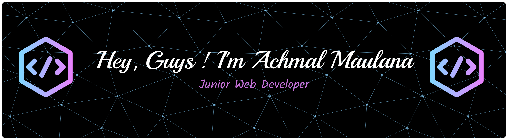

---

## 🎭 Who Am I?
<p align="center">
  <a href="https://git.io/typing-svg">
    
  </a>
</p>
I'm a **Software Engineering** student and a passionate **Junior Web Developer**. My journey in tech spans from building responsive web applications with full-stack capabilities to exploring mobile development and system administration. I thrive on solving problems, optimized data handling, and building automated tools that make life easier.

```python
class AchmalMaulana:
    def __init__(self):
        self.name  = "Achmal Maulana"
        self.role = "Software Engineering & Junior Web Developer"
        self.born = "Jakarta, Indonesia"
        self.location = "Cilacap, Indonesia"
        self.github_handle = "GomalRajaGula"

    def get_current_focus(self):
        return [
            "🚀 Building Responsive Web Applications",
            "📱 Shopee Driver",
        ]
 ```
 
## 🌐 Socials:
[](https://instagram.com/mal.dubeonjjae) [](https://linkedin.com/in/Achmal Maulana) [](mailto:maulanaachmal237@gmail.com) 

---

# 💻 Tech Stack:
        

  

      

    

---
# 📊 GitHub Stats:
<br/>
<br/>


---
[](https://visitcount.itsvg.in)

<!-- Proudly created with GPRM ( https://gprm.itsvg.in ) -->